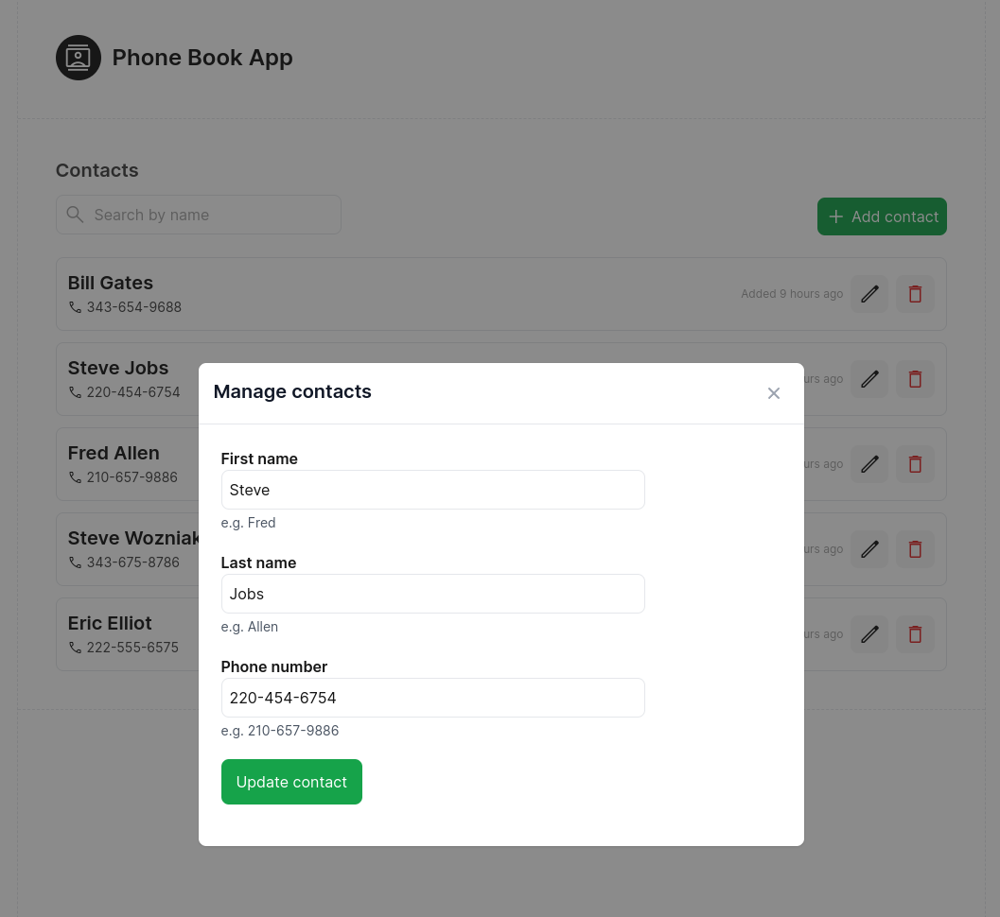

# Phone book monorepo

## How to access the app

- Visit https://phone-book.jearally.com
- API is accessible at https://api.phone-book.jearally.com/status.get

## How to run the app

- Run `npm install`
- Install the VS Code Extension "Terminals Manager" and in the Command Palette run the `Terminals: Run` command.
- Ensure that you have `PHONEBOOK_PRISMA_DATABASE_URL` set in your system's environment variables.

## About the app

- Frontend built with Vue 3 (Composition API, Vue Router, FormKit, tRPC client)
- API built with tRPC framework and Fastify
- Prisma ORM on top of PostgreSQL database. Types make it all the way into frontend code!

